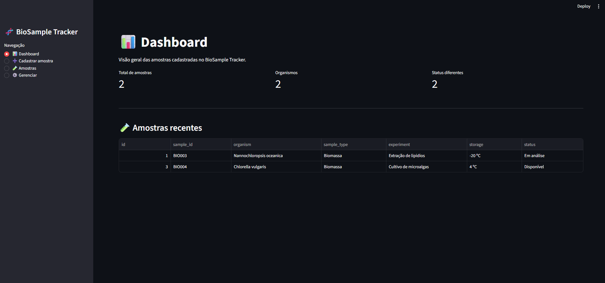
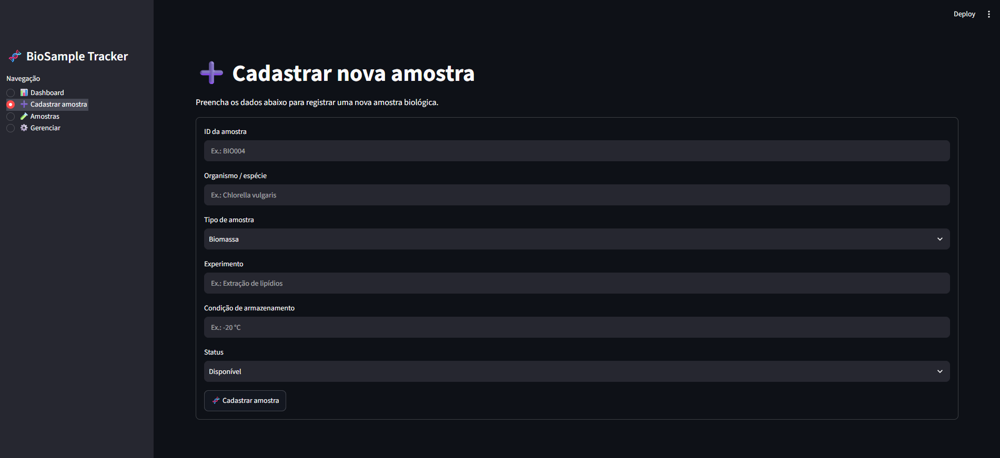
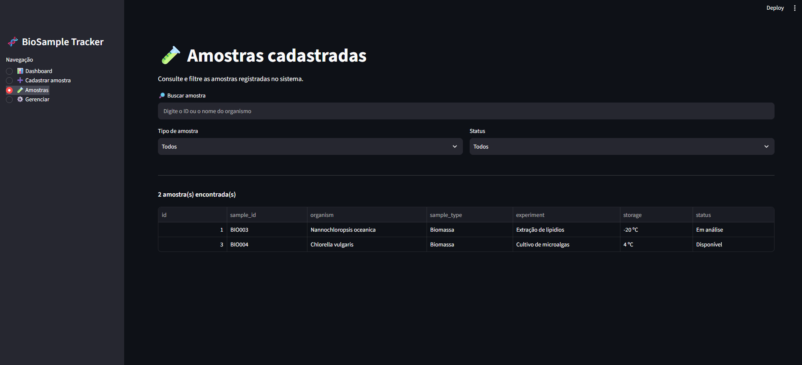
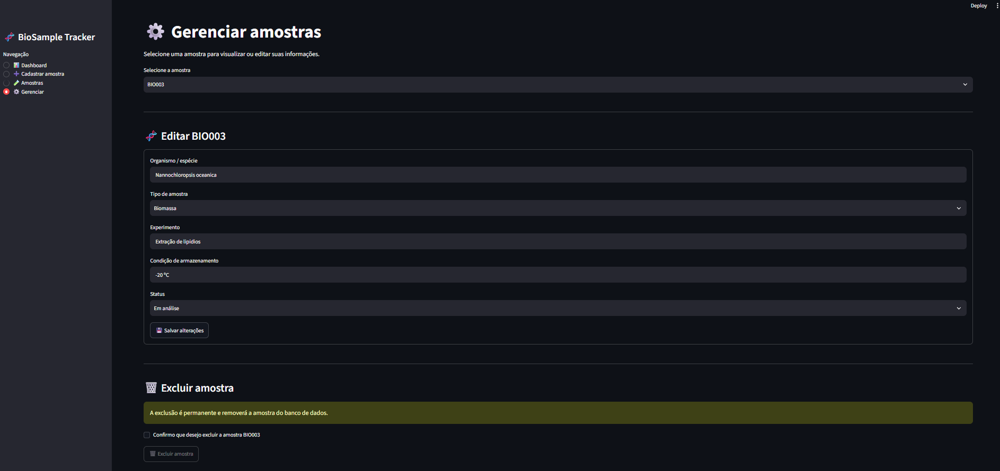

# 🧬 BioSample Tracker

Sistema web para gerenciamento e rastreabilidade de amostras biológicas desenvolvido em Python.

## 📌 Sobre o projeto

O BioSample Tracker é uma aplicação desenvolvida para cadastro, consulta, atualização e gerenciamento de amostras biológicas em ambiente laboratorial.

O projeto foi inicialmente desenvolvido para gerenciamento de amostras de microalgas e foi estruturado para futura expansão para diferentes categorias de materiais biológicos e biotecnológicos, incluindo extratos de compostos bioativos, proteínas, enzimas, DNA e RNA.

## 🖥️ Demonstração

### Dashboard

O dashboard apresenta uma visão geral das amostras cadastradas, incluindo o número total de amostras, organismos registrados e diferentes status de processamento.



### Cadastro de amostras

A interface de cadastro permite registrar novas amostras biológicas com identificação, organismo ou espécie, tipo de amostra, experimento, condição de armazenamento e status.



### Consulta e filtros

As amostras cadastradas podem ser consultadas por ID ou organismo e filtradas por tipo de amostra e status.



### Gerenciamento

O módulo de gerenciamento permite localizar registros existentes, atualizar informações e excluir amostras do banco de dados.



## ✨ Funcionalidades

- Cadastro de amostras biológicas
- Consulta de amostras
- Busca por ID ou organismo
- Filtros por tipo e status
- Atualização de informações
- Exclusão de registros com confirmação
- Validação de IDs duplicados
- Dashboard com indicadores
- Persistência dos dados em banco SQLite

## 🛠️ Tecnologias utilizadas

- Python
- Streamlit
- Pandas
- SQLite
- Git

## 🗂️ Estrutura inicial

```text
BioSample-Tracker/
├── app.py
├── web_app.py
├── database.py
├── consultar.py
├── biosamples.db
├── requirements.txt
├── .gitignore
└── README.md